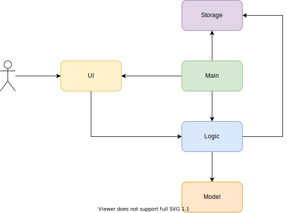
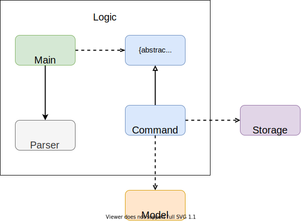
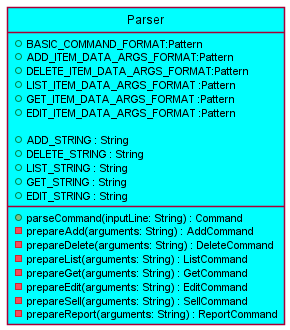

# Developer Guide

## Table of Contents
1. [Introduction](#introduction)
2. [Setting up](#setting-up)
3. [Acknowledgements](#acknowledgements)
4. [Design](#design)
   1. [Architecture](#architecture)
   2. [UI Component](#ui-component)
   3. [Logic Component](#logic-component)
   4. [Model Component](#model-component)
   5. [Storage Component](#storage-component)
5. [Implementation](#implementation)
   1. [Adding an item](#adding-an-item)
   2. [Editing an item](#editing-an-item)
   3. [Listing all items](#listing-all-items)
   4. [Getting an item](#getting-an-item)
   5. [Selling an item](#selling-an-item)
   6. [Generating sales report](#generating-sales-report)
   7. [Getting help](#getting-help)
   8. [Exiting the program](#editing-an-item)
6. [Product Scope](#product-scope)
7. [User stories](#user-stories)
8. [Non-Functional Requirements](#non-functional-requirements)
9. [Glossary](#glossary)
10. [Instructions for manual testing](#instructions-for-manual-testing)

___

## Introduction
**Welcome to CLIver Shelf!**

**CLIver Shelf** is a desktop command line interface-based app for bookstore owners to manage their bookstore. 
With **CLIver Shelf**, owners can easily keep track of their items in their shelves, and even generate a sales report so that they know how well their business is going. 

This guide describes the design, implementation and architecture of **CLIver Shelf**. The aim of this developer guide is to get developers 
and potential contributors to get familiarised with the implementation of **CLIver Shelf**.

___
## Setting up
**Pre-requisites**
1. JDK 11
2. IntelliJ IDEA IDE

**Setting up the Project in Your Computer**
1. Fork [this repository](https://github.com/AY2122S1-CS2113T-F11-4/tp), and clone the fork to your computer.
2. Open up IntelliJ. If you are not at the welcome screen, click `File` > `Close Project` to close any existing project
3. Set up the correct JDK version for Gradle
   1. Click `File` > `New Project Setup` > `Structure`, and ensure `Project SDK` is using `JDK 11`. Click `OK`
4. Import the project
   1. Click `File` > `Open Project`
   2. Select the project directory, and click `OK` to accept the default settings
5. Verify the setup: After the importing is complete, locate `Duke.java` file, right-click it and `Run 'Duke.main()'`. If the setup is correct, you should see something like this:
```
> Task :compileJava UP-TO-DATE
> Task :processResources NO-SOURCE
> Task :classes UP-TO-DATE

> Task :Duke.main()
Hello from
 ____        _        
|  _ \ _   _| | _____ 
| | | | | | | |/ / _ \
| |_| | |_| |   <  __/
|____/ \__,_|_|\_\___|
What is your name?
```
___
## Acknowledgements
1. [addressbook-level3](https://se-education.org/addressbook-level3/)
2. Adapted Parser code: [AddressBook (Level 2)](https://github.com/se-edu/addressbook-level2)
___
## Design

All UML diagrams in this guide are stored in `docs/diagrams` directory.


### Architecture

The architecture diagram above describes the design of CLIver Shelf. The main components are:

1. `Main` Responsible for initializing the various components and connecting them up with one another at app launch.  
2. `UI`: Handles the interactions with the user. 
3. `Logic`: Parses and executes the user input commands.
4. `Model`: Holds the data of the App in memory
5. `Storage`: Reads data from, and writes data to, the hard disk.


### General Program Flow

1. User runs the programs & input user commands
2. `CLIverShelf` calls `Parser` to `parseCommand()`
3. `Parser` creates and returns a `Command` object when parsed successful
4. `CLIverShelf` calls the `Command` object to `execute()`, and it returns a String `result`
5. `CLIverShelf` instantiates `UI` component to print the `result`


### UI component

The `UI` component is responsible for all the user inputs and system outputs. It is in charge of the display of success command executions, error messages and also user interactions by prompting for the next command.

The class diagram below shows the associations between classes of the UI components


The `UI` component is made up of 2 classes:
* `MessageBubble`: Responsible for the display of messages
* `PredefinedMessages`: Holds the messages required for MessageBubble to print to console.

### Logic component

The class diagram below shows the associations between the classes that make up the `Logic` component.



The `Logic` component consists of `Parser` and `Command` components. 
1. After user enters input, `UI` fetches and passes it to Parser for parsing.
2. Parser then returns a `Command` object, which is then executed.
3. The command execution directly affects the objects in the `Model` component.
4. After execution, `Command` instructs the `UI` component to print out relevant output messages (e.g successful command execution or error messages)
5. `Command` then checks the `ExitCommand` on whether the program should exit.
6. In the absence of `ExitCommand`, UI then takes over to prompt and process the next user input.


**API**:

1. [Parser.java](https://github.com/AY2122S1-CS2113T-F11-4/tp/blob/master/src/main/java/seedu/duke/parser/Parser.java)
   
   1. When user enters a command into the terminal, upon submission, the `Main` program receives the input line and calls the `Parser` to `parseCommand()`
   2. `Parser` first checks for BASIC_COMMAND_FORMAT, to extract the 1st word in the input which is the `commandWord`
   3. The commandWord would then be checked against the respective `COMMAND_STRINGS` such as `ADD_STRING`, `DELETE_STRING` shown in the diagram below.
   4. If the `COMMAND_WORD` matches any of the strings, the function will proceed to execute the `prepare{commandWord}()` function of the `Parser`
      1. Else, if not match any string the `parseCommand()` will throw an `IllegalFormatException`
   5. Lastly, when the Parsing is complete, the PArser will return the `{commandWord}Command` to the `Main` component
   


2. [Command.java](https://github.com/AY2122S1-CS2113T-F11-4/tp/blob/master/src/main/java/seedu/duke/command/Command.java)
    1. `Command` is an abstract class and has an abstract method `execute(list: Shelf)`.
    2. Specific commands, such as `AddCommand` or `DeleteCommand`, are the subclasses of `Command`. They will be instantiated inside the `parseCommand(userInputLine: String, list: Shelf): Command` method of parser and then executed in the main class.
    3. Use `AddCommand` as an example. The following sequence diagram illustrates how `AddCommand` interacts with other components of the system.


### Model component

**API**:

1. [Item.java](https://github.com/AY2122S1-CS2113T-F11-4/tp/blob/master/src/main/java/seedu/duke/model/Item.java)
   1. A `Item` object stores the information about a product in the bookstore:
      1. `name` of the product, consists of alphabet, number, whitespace, underscore and round bracket. e.g., Time Magazine.
      2. `purchaseCost`, the non-negative price the bookstore owner paid for the product. 
      3. `sellingPrice`, the non-negative amount a buyer pays for the product.
2. [Shelf.java](https://github.com/AY2122S1-CS2113T-F11-4/tp/blob/master/src/main/java/seedu/duke/model/Shelf.java)
    1. A `Shelf` object stores `Item` objects.
    2. All `Item` are stored in one and only one of the `Shelf` objects.
    3. A `Shelf` object can be instantiated using the constructor `new Shelf(name: String)` or `ShelfList.getShelfList().addShelf(name: String)`
3. [ShelfList.java](https://github.com/AY2122S1-CS2113T-F11-4/tp/blob/master/src/main/java/seedu/duke/model/ShelfList.java)
    1. The `ShelfList` stores all the shelves data i.e., all `Shelf` objects
    2. `ShelfList` is implemented using Singleton Pattern. The single instance can be obtained using `ShelfList.getShelfList()`

The Sequence Diagram below illustrates how `Shelf` and `ShelfList` interacts when different `Shelf` instantiation methods are used.


### Storage component
The storage component consists of `Storage` class. 
It handles the saving of user data by the command component and also loading data on program start up.

The diagram below shows the implementation of `saveData()`.


The diagram below shows the implementation of `loadData()`


___
## Implementation

### Adding an item


#### Design considerations:
* Aspect: Long chain for add command
   * Alternative 1 (current choice): Long command with chain of flags such `/n` for name and `/q` for quantity.
      * Pros: Clear demarcation of different parameters that users have to input.
      * Cons: Susceptible to errors as users might miss out some flags.
   * Alternative 2: No flags required for each parameter.
      * Pros: Shorter command length, less prone to errors.
      * Cons: Increased difficulty in parsing and higher chance to encounter exceptions or errors.
   * Alternative 3: Prompt for different inputs for each parameter after pressing `enter`
     * Pros: Even less prone to human errors as the user is prompted what is required as input each time.
     * Cons: Additional methods and passing of data will be required. 

### Editing an item

#### Design considerations:

### Listing all items

#### Design considerations:

### Getting an item

#### Design considerations:

### Selling an item

#### Design considerations:

### Generating sales report

#### Design considerations:

### Getting help

### Exiting the program


___
## Product scope

### Target user profile

* has a need to manage inventories & finances of small scaled book stores
* prefers to operate the store by themselves without additional hires
* prefers typing to clicking on GUI applications
* ability to type fast
* comfortable with command line applications
* does not mind the plain output from command line applications

### Value proposition

Allows efficient and simplified management of inventory and finances of the store
___
## User Stories

|Version| As a ... | I want to ... | So that I can ...|
|--------|----------|---------------|------------------|
|v1.0|new user|see usage instructions|refer to them when I forget how to use the application|
|v1.0|user|add new items to inventory list||
|v1.0|user|delete items from inventory list|remove entries that I no longer need|
|v1.0|user|get a list of inventory according to their category|keep track of what I have in stock for selling|
|v1.0|user|retrieve information about an item|decide if I need to restock|
|v1.0|user|update the information of the items|keep the list updated|
|v2.0|user|store and retrieve the inventory list|save the data when program closes and automatically loads when program restarts|
|v2.0|user|retrieve a list of items low in stock|replenish items low in stock|
|v2.0|user|mark an item as sold|remove item from inventory list and add to revenue|
|v2.0|user|add the total cost of all the items|know the total cost and deduct from revenue to find profit|
|v2.0|user|view the monthly sales report|know if I am making a profit|
|v2.0|user|create a shelf|store items into the shelf|
|v2.0|user|remove a shelf|remove the shelf if the shelf is empty|
|v2.0|user|view the estimated markup price for an item|know the percentage returns i can get from the markup|
___
## Non-Functional Requirements
1. Should work on mainstream OS such as Windows and Linux as long as it has Java 11 or above installed.
2. Users with fast typing speed should be able to accomplish tasks faster using commands than using the mouse
3. Users should be able to easily understand the command formats in the User Guide and use the commands to accomplish the tasks.
4. Users should be able to see improvements in terms of the efficiency and management of the bookstore within a months of using the app.

## Glossary

* *Mainstream OS* - MacOS, Windows, Linux, Unix

## Instructions for manual testing

Given below are the instructions to test the app manually.

:information_source: **Note:** These instructions only provide a base of how the app is currently being tested by the 
developing team. These test cases may and may not cover all possible outcomes. You are welcome to do more exploratory testing. 
Should there be any bugs, please do contact 
the [developing team](https://ay2122s1-cs2113t-f11-4.github.io/tp/AboutUs.html).

### Launch and shut down

#### Initial launch
1. Download and save the latest JAR file in a desired file directory.
2. Open up your terminal and navigate to where that directory is saved.
3. Run `java -jar Duke.jar` to launch the program. 
4. A `data` folder containing `output.txt` is expected to appear.

#### Subsequent launch
1. Open up your terminal and navigate to where the directory in which the JAR file is saved under.
2. Run `java -jar Duke.jar` to launch the program.
3. Data will be automatically saved into the data file.

#### Shut down
1. To terminate the program, type `bye`.
2. Data will be automatically saved into the data file.
3. The data is expected to still be saved normally even if program crashes.

### Getting help
1. To get help information, type `help`.

### Creating a shelf
1. To create a shelf with a unique name that does not exit before in the shelf list.
   1. Pre-requisites shelf name `Book1` does not previously exist. The user may check by doing a `list`.
   2. Test case 1: `create shlv/Book1`
      Expected: Shelf name `Book1` will be created.

   3. Test case 2: `create shlv/Book1`
      Expected: DuplicateShelfException thrown, details will be shown in the output. No shelf name `Book1` is created again, since the shelf name already exists. 

   4. Test case 3: User inputs with the incorrect format such as `create`, `create shlv/`, `create sh`, `create shlv/Book2 shlv/Pencil1` 
      Expected: IllegalFormatException thrown, details of the correct format would be shown to help the user to correct the input line.

### Removing a shelf
1. To remove a shelf with a unique name that exist in the shelf list.
   1. Pre-requisites shelf name `Book1` previously exist. The user may check by doing a `list`.
      1. Test case 1: `remove shlv/Book1`
         Expected: Shelf name** `Book1` will be removed. 
   2. Test case 2: remove a shelf that has already been removed. `remove shlv/Book1` again
      Expected: Shows output message that shelf does not exist.
   3. Test case 3: User inputs with the incorrect format such as `remove`, `remove shlv/`, `remove sh`, `remove shlv/Book2 shlv/Pencil1`
      Expected: IllegalFormatException thrown, details of the correct format would be shown to help the user to correct the input line.

### Adding an item

### Deleting an item

### Getting information of an item

### Listing the items

### Editing an item

### Getting a Report

* Format: `report t/CONTENT_TYPE ym/YEAR-MONTH [ym/YEAR-MONTH]`
* Pre-requisite: Some items must be sold first to view the report with data.

| Test Case  | Command | Expected Result|
| ------------- | ------------- | ------------- |
| Statistics report  | `report t/stats ym/2021-10`  | shows statistics for Oct 2021 |
| Items report  | `report t/items ym/2021-10`  | shows items sold for Oct 2021 |
| Items report in between time period | `report t/items ym/2021-10 ym/2021-11` | shows items sold between Oct 2021 and Nov 2021 inclusive |
| Report in invalid year-month | `report t/items ym/0000-10`  | shows invalid year error |
| Report in year-month that does not have items sold | `report t/items ym/2010-10`  | Shows no items sold in Oct 2010 |
| Report in between a time period that does not have items sold | `report t/items ym/1970-01 ym/2010-10` | Shows no items sold in between Jan 1970 and Oct 2010 |
| Time YearMonth not in chronological order | `report t/items ym/2021-11 ym/2021-01` | Shows error time parameters are swapped |
| Missing parameters  | `report t/items` | Error message (invalid format) |
| Invalid date format  | `report t/items ym/21-10`  | Error message (invalid format) |

### Selling an item
1. 

### Markup price of an item

* Format: `markup shlv/SHELF_NAME i/INDEX [%/PERCENT_MARKUP]` 
* Pre-requisite: There must be items added to a shelf first.

| Test Case  | Command | Expected Result|
| ------------- | ------------- | ------------- |
| Percent Markup not specified | `markup shlv/book1 i/1` | shows estimated user markup in multiples of 20 till max of 100% |
| Normal percent markup less than 999.99 | `markup shlv/book1 i/1 %/5` | Shows current item markup & the final estimated price after user markup percent |
| Percent markup more than 2 dp | `markup shlv/book1 i/1 %/5.001` | Error message (invalid format) |
| Percent markup more than 1000 dp | `markup shlv/book1 i/1 %/1234.67` | Error message (invalid format) |
| Non-existent shelf | `markup shlv/notexistshelf i/1 %/12.34` | Error message (shelf does not exist) |
| Index out of bounds | `markup shlv/book1 i/999 %/12.34` | Error message (item at index not found) |
| Markup item from soldItems shelf | `markup shlv/soldItems i/1 %/12.34` | Error message (operation not permitted) |
| Missing information | `markup shlv/book1 i/1 %/` | Error message (invalid format) |
| Missing Parameters | `markup shlv/book1 %/9` | Error message (invalid format) |

