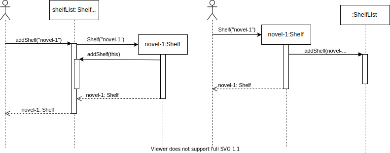

# Developer Guide

## Table of Contents
1. [Introduction](#introduction)
2. [Setting up](#setting-up)
3. [Acknowledgements](#acknowledgements)
4. [Design](#design)
   1. [Architecture](#architecture)
   2. [UI Component](#ui-component)
   3. [Logic Component](#logic-component)
   4. [Model Component](#model-component)
   5. [Storage Component](#storage-component)
5. [Implementation](#implementation)
6. [Product Scope](#product-scope)
7. [User stories](#user-stories)
8. [Non-Functional Requirements](#non-functional-requirements)
9. [Glossary](#glossary)
10. [Instructions for manual testing](#instructions-for-manual-testing)

___

## Introduction
**Welcome to CLIver Shelf!**

**CLIver Shelf** is a desktop command line interface-based app for bookstore owners to manage their bookstore. 
With **CLIver Shelf**, owners can easily keep track of their items in their shelves, and even generate a sales report so that they know how well their business is going. 

This guide describes the design, implementation and architecture of **CLIver Shelf**. The aim of this developer guide is to get developers 
and potential contributors to get familiarised with the implementation of **CLIver Shelf**.

___
## Setting up
**Pre-requisites**
1. JDK 11
2. IntelliJ IDEA IDE

**Setting up the Project in Your Computer**
1. Fork [this repository](https://github.com/AY2122S1-CS2113T-F11-4/tp), and clone the fork to your computer.
2. Open up IntelliJ. If you are not at the welcome screen, click `File` > `Close Project` to close any existing project
3. Set up the correct JDK version for Gradle
   1. Click `File` > `New Project Setup` > `Structure`, and ensure `Project SDK` is using `JDK 11`. Click `OK`
4. Import the project
   1. Click `File` > `Open Project`
   2. Select the project directory, and click `OK` to accept the default settings
5. Verify the setup: After the importing is complete, locate `Duke.java` file, right-click it and `Run 'Duke.main()'`. If the setup is correct, you should see something like this:
```
> Task :compileJava UP-TO-DATE
> Task :processResources NO-SOURCE
> Task :classes UP-TO-DATE

> Task :Duke.main()
Hello from
 ____        _        
|  _ \ _   _| | _____ 
| | | | | | | |/ / _ \
| |_| | |_| |   <  __/
|____/ \__,_|_|\_\___|
What is your name?
```
___
## Acknowledgements
1. [addressbook-level3](https://se-education.org/addressbook-level3/)
___
## Design

All UML diagrams in this guide are stored in `docs/diagrams` directory.

### Architecture

The architecture diagram above describes the design of CLIver Shelf. The main components are:

1. `Main` Responsible for initializing the various components and connecting them up with one another at app launch.  
2. `UI`: Handles the interactions with the user. 
3. `Logic`: Parses and executes the user input commands.
4. `Model`: Holds the data of the App in memory
5. `Storage`: Reads data from, and writes data to, the hard disk.


### UI component

The `UI` component is responsible for all the user inputs and system outputs. It is in charge of the display of success command executions, error messages and also user interactions by prompting for the next command.

The class diagram below shows the associations between classes of the UI components


The `UI` component is made up of 2 classes:
* `MessageBubble`: Responsible for the display of messages
* `PredefinedMessages`: Holds the messages required for MessageBubble to print to console.

### Logic component

The class diagram below shows the associations between the classes that make up the `Logic` component.


The `Logic` component consists of `Parser` and `Command` components. 
1. After user enters input, `UI` fetches and passes it to Parser for parsing.
2. Parser then returns a `Command` object, which is then executed.
3. The command execution directly affects the objects in the `Model` component.
4. After execution, `Command` instructs the `UI` component to print out relevant output messages (e.g successful command execution or error messages)
5. `Command` then checks the `ExitCommand` on whether the program should exit.
6. In the absence of `ExitCommand`, UI then takes over to prompt and process the next user input.


**API**:

1. [Parser.java](https://github.com/AY2122S1-CS2113T-F11-4/tp/blob/master/src/main/java/seedu/duke/parser/Parser.java)

2. [Command.java](https://github.com/AY2122S1-CS2113T-F11-4/tp/blob/master/src/main/java/seedu/duke/command/Command.java)
    1. `Command` is an abstract class and has an abstract method `execute(list: Shelf)`.
    2. Specific commands, such as `AddCommand` or `DeleteCommand`, are the subclasses of `Command`. They will be instantiated inside the `parseCommand(userInputLine: String, list: Shelf): Command` method of parser and then executed in the main class.
    3. Use `AddCommand` as an example. The following sequence diagram illustrates how `AddCommand` interacts with other components of the system.


### Model component


**API**:

1. [Item.java](https://github.com/AY2122S1-CS2113T-F11-4/tp/blob/master/src/main/java/seedu/duke/model/Item.java)
   1. A `Item` object stores the information about a product in the bookstore:
      1. `name` of the product, consists of alphabet, number, whitespace, underscore and round bracket. e.g., Time Magazine.
      2. `purchaseCost`, the non-negative price the bookstore owner paid for the product. 
      3. `sellingPrice`, the non-negative amount a buyer pays for the product.
2. [Shelf.java](https://github.com/AY2122S1-CS2113T-F11-4/tp/blob/master/src/main/java/seedu/duke/model/Shelf.java)
    1. A `Shelf` object stores `Item` objects.
    2. All `Item` are stored in one and only one of the `Shelf` objects.
    3. A `Shelf` object can be instantiated using the constructor `new Shelf(name: String)` or `ShelfList.getShelfList().addShelf(name: String)`
3. [ShelfList.java](https://github.com/AY2122S1-CS2113T-F11-4/tp/blob/master/src/main/java/seedu/duke/model/ShelfList.java)
    1. The `ShelfList` stores all the shelves data i.e., all `Shelf` objects
    2. `ShelfList` is implemented using Singleton Pattern. The single instance can be obtained using `ShelfList.getShelfList()`

The Sequence Diagram below illustrates how `Shelf` and `ShelfList` interacts when different `Shelf` instantiation methods are used.


### Storage component
The storage component consists of `Storage` class. It handles the saving of user data by the command component and also loading data on program start up.
___
## Implementation
___
## Product scope

### Target user profile

* has a need to manage inventories & finances of small scaled book stores
* prefers to operate the store by themselves without additional hires
* prefers typing over clicking on GUI applications
* ability to type fast
* comfortable with command line applications
* does not mind the plain output from command line applications

### Value proposition

Allows efficient and simplified management of inventory and finances of the store
___
## User Stories

|Version| As a ... | I want to ... | So that I can ...|
|--------|----------|---------------|------------------|
|v1.0|new user|see usage instructions|refer to them when I forget how to use the application|
|v1.0|user|add new items to inventory list||
|v1.0|user|delete items from inventory list|remove entries that I no longer need|
|v1.0|user|get a list of inventory according to their category|keep track of what I have in stock for selling|
|v1.0|user|retrieve information about an item|decide if I need to restock|
|v1.0|user|update the information of the items|keep the list updated|
|v2.0|user|store and retrieve the inventory list|save the data when program closes and automatically loads when program restarts|
|v2.0|user|retrieve a list of items low in stock|replenish items low in stock|
|v2.0|user|mark an item as sold|remove item from inventory list and add to revenue|
|v2.0|user|add the total cost of all the items|know the total cost and deduct from revenue to find profit|
|v2.0|user|view the monthly sales report|know if I am making a profit|

___
## Non-Functional Requirements
1. Should work on mainstream OS such as Windows and Linux as long as it has Java 11 or above installed.
2. Users with fast typing speed should be able to accomplish tasks faster using commands than using the mouse

___
## Glossary

* *glossary item* - Definition
___
## Instructions for manual testing

{Give instructions on how to do a manual product testing e.g., how to load sample data to be used for testing}
