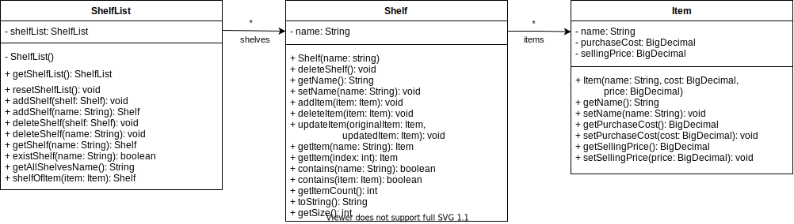

# Developer Guide

## Acknowledgements

{list here sources of all reused/adapted ideas, code, documentation, and third-party libraries -- include links to the
original source as well}

## Design & implementation

{Describe the design and implementation of the product. Use UML diagrams and short code snippets where applicable.}

### Architecture

### UI component

### Logic component

**API**:

1. [Parser.java](https://github.com/AY2122S1-CS2113T-F11-4/tp/blob/master/src/main/java/seedu/duke/parser/Parser.java)

2. [Command.java](https://github.com/AY2122S1-CS2113T-F11-4/tp/blob/master/src/main/java/seedu/duke/command/Command.java)
    1. `Command` is an abstract class and has an abstract method `execute(list: Shelf)`.
    2. Specific commands, such as `AddCommand` or `DeleteCommand`, are the subclasses of `Command`. They will be instantiated inside the `parseCommand(userInputLine: String, list: Shelf): Command` method of parser and then executed in the main class.
    3. Use `AddCommand` as an example. The following sequence diagram illustrates how `AddCommand` interacts with other components of the system.

### Model component

**API**:

1. [Item.java](https://github.com/AY2122S1-CS2113T-F11-4/tp/blob/master/src/main/java/seedu/duke/model/Item.java)
   1. A `Item` object stores the information about a product in the bookstore:
      1. `name` of the product, consists of alphabet, number, whitespace, underscore and round bracket. e.g., Time Magazine.
      2. `purchaseCost`, the non-negative price the bookstore owner paid for the product. 
      3. `sellingPrice`, the non-negative amount a buyer pays for the product.
2. [Shelf.java](https://github.com/AY2122S1-CS2113T-F11-4/tp/blob/master/src/main/java/seedu/duke/model/Shelf.java)
    1. A `Shelf` object stores `Item` objects.
    2. All `Item` are stored in one and only one of the `Shelf` objects.
    3. A `Shelf` object can be instantiated using the constructor `new Shelf(name: String)` or `ShelfList.getShelfList().addShelf(name: String)`
3. [ShelfList.java](https://github.com/AY2122S1-CS2113T-F11-4/tp/blob/master/src/main/java/seedu/duke/model/ShelfList.java)
    1. The `ShelfList` stores all the shelves data i.e., all `Shelf` objects
    2. `ShelfList` is implemented using Singleton Pattern. The single instance can be obtained using `ShelfList.getShelfList()`

The Sequence Diagram below illustrates how `Shelf` and `ShelfList` interacts when different `Shelf` instantiation methods are used.

### Storage component

## Product scope

### Target user profile

{Describe the target user profile}

### Value proposition

{Describe the value proposition: what problem does it solve?}

## User Stories

|Version| As a ... | I want to ... | So that I can ...|
|--------|----------|---------------|------------------|
|v1.0|new user|see usage instructions|refer to them when I forget how to use the application|
|v2.0|user|find a to-do item by name|locate a to-do without having to go through the entire list|

## Non-Functional Requirements

{Give non-functional requirements}

## Glossary

* *glossary item* - Definition

## Instructions for manual testing

{Give instructions on how to do a manual product testing e.g., how to load sample data to be used for testing}
