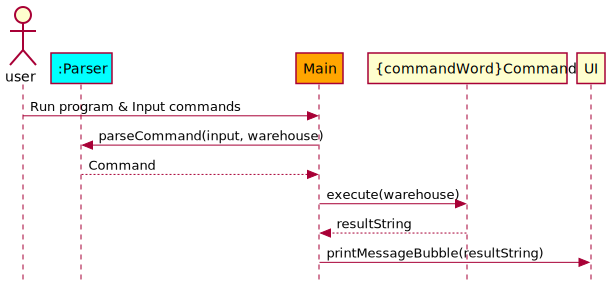
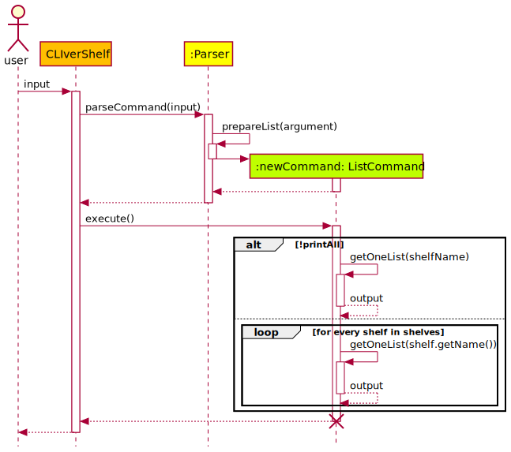
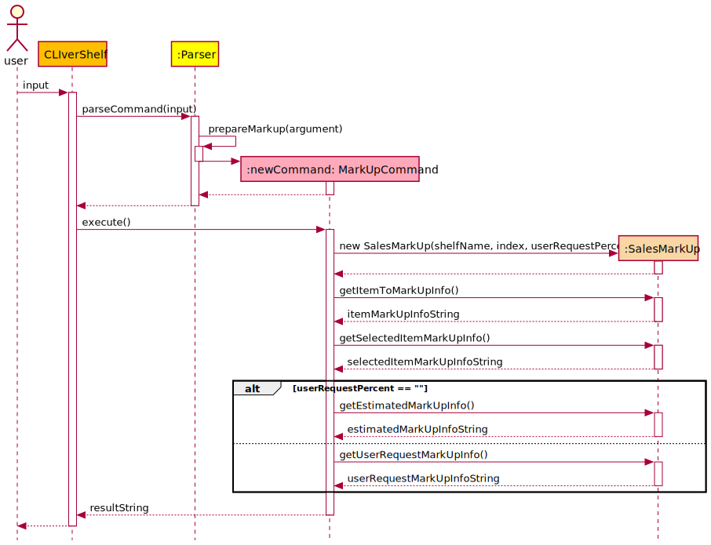

# Developer Guide

## Table of Contents

1. [Introduction](#introduction)
2. [Setting up](#setting-up)
3. [Acknowledgements](#acknowledgements)
4. [Design](#design)
    1. [Architecture](#architecture)
    2. [UI Component](#ui-component)
    3. [Logic Component](#logic-component)
        1. [SubComponent Parser](#subcomponent-parser)
        2. [Subcomponent Command](#subcomponent-command)
            1. [Subcomponent Sales](#subcomponent-sales)
    4. [Model Component](#model-component)
    6. [Storage Component](#storage-component)
5. [Implementation](#implementation)
    1. [Adding an item](#adding-an-item)
    2. [Editing an item](#editing-an-item)
    3. [Listing all items](#listing-all-items)
    4. [Getting an item](#getting-an-item)
    5. [Selling an item](#selling-an-item)
    6. [Generating sales report](#generating-sales-report)
    7. [Generating item markup price](#generating-item-markup-price)
    8. [Exiting the program](#editing-an-item)
6. [Product Scope](#product-scope)
7. [User stories](#user-stories)
8. [Non-Functional Requirements](#non-functional-requirements)
9. [Glossary](#glossary)
10. [Instructions for manual testing](#instructions-for-manual-testing)

## Introduction

**Welcome to CLIverShelf!**

**CLIverShelf** is a desktop command line interface-based app for bookstore owners to manage their bookstore. With
**CLIverShelf**, owners can easily keep track of their items in their shelves, and even generate a sales report so that
they know how well their business is going.

This guide describes the design, implementation and architecture of **CLIverShelf**. The aim of this developer guide is
to get developers and potential contributors to get familiarised with the implementation of **CLIverShelf**.

## Setting up

**Pre-requisites**

1. JDK 11
2. IntelliJ IDEA IDE

**Setting up the Project in Your Computer**

1. Fork [this repository](https://github.com/AY2122S1-CS2113T-F11-4/tp), and clone the fork to your computer.
2. Open up IntelliJ. If you are not at the welcome screen, click `File` > `Close Project` to close any existing project
3. Set up the correct JDK version for Gradle
    1. Click `File` > `New Project Setup` > `Structure`, and ensure `Project SDK` is using `JDK 11`. Click `OK`
4. Import the project
    1. Click `File` > `Open Project`
    2. Select the project directory, and click `OK` to accept the default settings
5. Verify the setup: After the importing is complete, locate `CliverShelf.java` file, right-click it
   and `Run 'CliverShelf.main()'`. If the setup is correct, you should see something like this:

```
                                                                  .............................................................
                                                                  : Hello from                                                :
                                                                  :   _____ _      _____              _____ _          _  __  :
                                                                  :  / ____| |    |_   _|            / ____| |        | |/ _| :
                                                                  : | |    | |      | |_   _____ _ _| (___ | |__   ___| | |_  :
                                                                  : | |    | |      | \ \ / / _ \ '__\___ \| '_ \ / _ \ |  _| :
                                                                  : | |____| |____ _| |\ V /  __/ |  ____) | | | |  __/ | |   :
                                                                  :  \_____|______|_____\_/ \___|_| |_____/|_| |_|\___|_|_|   :
                                                                  : What can I do for you?                                    :
                                                                  ................................................................
                                                                            ...................................................
                                                                            : Enter 'help' for the list of available commands :
                                                                            ......................................................
```

## Acknowledgements

1. [addressbook-level3](https://se-education.org/addressbook-level3/)
2. Adapted Parser code: [AddressBook (Level 2)](https://github.com/se-edu/addressbook-level2)

## Design

All UML diagrams in this guide are stored in `docs/diagrams` directory.

### Architecture


The architecture diagram above describes the design of CLIverShelf. The main components are:

1. `CliverShelf` Responsible for initializing the various components and connecting them up with one another at app
   launch.
2. `UI`: Handles the interactions with the user.
3. `Logic`: Parses and executes the user input commands.
4. `Model`: Holds the data of the App in memory
5. `Storage`: Reads data from, and writes data to, the hard disk.

### General Program Flow

1. User runs the programs & input user commands
2. `CliverShelf` calls `Parser` to `parseCommand()`
3. `Parser` creates and returns a `Command` object when parsed successful
4. `CliverShelf` calls the `Command` object to `execute()`, and it returns a String `result`
5. `CliverShelf` instantiates `UI` component to print the `result`



### UI component

The `UI` component is responsible for all the user inputs and system outputs. It is in charge of the display of success
command executions, error messages and also user interactions by prompting for the next command.

The class diagram below shows the associations between classes of the UI components


The `UI` component is made up of 2 classes:

* `MessageBubble`: Responsible for the display of messages
* `PredefinedMessages`: Holds the messages required for MessageBubble to print to console.

### Logic component

The class diagram below shows the associations between the classes that make up the `Logic` component.


The `Logic` component consists of `Parser` and `Command` components.

1. After user enters input, `UI` fetches and passes it to Parser for parsing.
2. Parser then returns a `Command` object, which is then executed.
3. The command execution directly affects the objects in the `Model` component.
4. After execution, `Command` instructs the `UI` component to print out relevant output messages (e.g successful command
   execution or error messages)
5. `Command` then checks the `ExitCommand` on whether the program should exit.
6. In the absence of `ExitCommand`, UI then takes over to prompt and process the next user input.


#### Subcomponent Parser

**API**:

1. [Parser.java](https://github.com/AY2122S1-CS2113T-F11-4/tp/blob/master/src/main/java/seedu/duke/parser/Parser.java)

    1. When user enters a command into the terminal, upon submission, `CliverShelf` receives the input line and calls
       the `Parser` to `parseCommand()`
    2. `Parser` first checks for BASIC_COMMAND_FORMAT, to extract the 1st word in the input which is the `commandWord`
    3. The commandWord would then be checked against the respective `COMMAND_STRINGS` such as `ADD_STRING`
       , `DELETE_STRING` shown in the diagram below.
    4. If the `COMMAND_WORD` matches any of the strings, the function will proceed to execute
       the `prepare{commandWord}()` function of the `Parser`
        1. Else, if not match any string the `parseCommand()` will throw an `IllegalFormatException`
    5. Lastly, when the Parsing is complete, the PArser will return the `{commandWord}Command` to the `CliverShelf`
       component


#### Subcomponent Command

2. [Command.java](https://github.com/AY2122S1-CS2113T-F11-4/tp/blob/master/src/main/java/seedu/duke/command/Command.java)
    1. `Command` is an abstract class and has an abstract method `execute(list: Shelf)`.
    2. Specific commands, such as `AddCommand` or `DeleteCommand`, are the subclasses of `Command`. They will be
       instantiated inside the `parseCommand(userInputLine: String, list: Shelf): Command` method of parser and then
       executed in the main class.
    3. Use `AddCommand` as an example. The following sequence diagram illustrates how `AddCommand` interacts with other
       components of the system.
       

##### Subcomponent Sales

This section describes how the subcomponent Sales interacts with the sales related commands. After the command input is
parsed, depending on the Command type, different types uses different sales API.

**API**:

1. [SalesManager.java](https://github.com/AY2122S1-CS2113T-F11-4/tp/blob/master/src/main/java/seedu/duke/sales/SalesManager.java)
    * Supports Both SellCommand & ReportCommand & Handles some Sales behaivour
        * When program invokes `SellCommand#execute`, a `SalesManager` object is created & `SalesManager#sell()` will be
          called to mark an item as sold
        * When program invokes `ReportCommand#execute`
            1. A `SalesReport` object is created & when either 1 of `SalesReport#generateSoldItemStats()`
               or `SalesReport#generateSoldItemDetails()` is called
            2. A `SalesManager` object is created & `SalesManager#sell()` will be called to mark an item as sold

2. [SalesReport.java](https://github.com/AY2122S1-CS2113T-F11-4/tp/blob/master/src/main/java/seedu/duke/sales/SalesReport.java)
    * Supports ReportCommand & Handles generation of sales report
        * When program invokes `ReportCommand#execute`, a `SalesReport` object is created
          & `SalesReport#generateSoldItemStats()`
          or `SalesReport#generateSoldItemDetails()` will be called to get the filterd solditems list for processing
          into strings before returning the String for printing.

3. [SalesMarkUp.java](https://github.com/AY2122S1-CS2113T-F11-4/tp/blob/master/src/main/java/seedu/duke/sales/SalesMarkUpele.java)
    * Supports MarkUpCommand & Handles Estimation of price markup of an item
        1. When program invokes `MarkUpCommand#execute`, a `SalesMarkUp` object is created
        2. `SalesMarkUp#getItemToMarkUpInfo()` & `SalesMarkUp#getSelectedItemMarkUpInfo()` is invoked to get current
           details of the selected item
        3. Then, if user markup percent is specified `SalesMarkUp#getUserRequestMarkUpInfo()` is invoked, to calculate
           the user requested markup information & final price
        4. Else, if user markup percent not specified `SalesMarkUp#getEstimatedMarkUpInfo()` is invoked, which get the
           general markup estimation in intervals of 20.


### Model component

**API**:

1. [Item.java](https://github.com/AY2122S1-CS2113T-F11-4/tp/blob/master/src/main/java/seedu/duke/model/Item.java)
    1. A `Item` object stores the information about a product in the bookstore:
        1. `name` of the product, consists of alphabet, number, whitespace, underscore and round bracket. e.g., Time
           Magazine.
        2. `purchaseCost`, the non-negative price the bookstore owner paid for the product.
        3. `sellingPrice`, the non-negative amount a buyer pays for the product.
2. [Shelf.java](https://github.com/AY2122S1-CS2113T-F11-4/tp/blob/master/src/main/java/seedu/duke/model/Shelf.java)
    1. A `Shelf` object stores `Item` objects.
    2. All `Item` are stored in one and only one of the `Shelf` objects.
    3. A `Shelf` object can be instantiated using the constructor `new Shelf(name: String)`
       or `ShelfList.getShelfList().addShelf(name: String)`
3. [ShelfList.java](https://github.com/AY2122S1-CS2113T-F11-4/tp/blob/master/src/main/java/seedu/duke/model/ShelfList.java)
    1. The `ShelfList` stores all the shelves data i.e., all `Shelf` objects
    2. `ShelfList` is implemented using Singleton Pattern. The single instance can be obtained
       using `ShelfList.getShelfList()`

The Sequence Diagram below illustrates how `Shelf` and `ShelfList` interacts when different `Shelf` instantiation
methods are used.


### Storage component

The storage component consists of `Storage` class. It handles the saving of user data by the command component and also
loading data on program start up.

The diagram below shows the implementation of `saveData()`.


The diagram below shows the implementation of `loadData()`


## Implementation

### Adding an item

#### Design considerations:

* Aspect: Long chain for add command
    * Alternative 1 (current choice): Long command with chain of flags such `/n` for name and `/q` for quantity.
        * Pros: Clear demarcation of different parameters that users have to input.
        * Cons: Susceptible to errors as users might miss out some flags.
    * Alternative 2: No flags required for each parameter.
        * Pros: Shorter command length, less prone to errors.
        * Cons: Increased difficulty in parsing and higher chance to encounter exceptions or errors.
    * Alternative 3: Prompt for different inputs for each parameter after pressing `enter`
        * Pros: Even less prone to human errors as the user is prompted what is required as input each time.
        * Cons: Additional methods and passing of data will be required.

### Editing an item

#### Design considerations:

* Aspect: How to change a cerntain property precisely
    * Alternative 1 (current choice): Let the user specify which property to edit using `/p` flag.
        * Pros: Only need to change one property.
        * Cons: Need one additional step to check which property is selected by the user.
    * Alternative 2: Let the user specify the new values for each property.
        * Pros: The user can change multiple properties at once using only one Edit command.
        * Cons: Longer input is needed from the user even if he/she just wants to change one property.

### Listing all items

The diagram below shows the sequence diagram for ListCommand, which is responsible for listing the items in the shelves.


A user can choose to either list out all the items in the bookstore (i.e every shelf), or within a specific shelf.

* If user wishes to list out all items within a **specific** shelf:
    1. He keys in `list shlv/[SHELF_NAME]`
    2. This invokes `Parser#parseCommand()`, and since the command argument is `list`, it will further
       invoke `Parser#prepareList()`.
    3. It will then construct a command `ListCommand` using `ListCommand(shelf: String)`, returning it back
       to `CliverShelf`.
    4. Back in `CliverShelf`, `ListCommand#execute()` is invoked and since `ListCommand(shelf: String)` is constructed,
       condition for `toPrintAll` is set to `false` and not satisfied. This invokes `ListCommand#getOneList()`
    5. The string result output is then passed back to `CliverShelf`.


* If user wishes to list out all the items in the bookstore:
    1. He keys in: `list`.
    2. This invokes `Parser#parseCommand()`, and since the input is `list` it will further invoke `Parser#prepareList()`
       .
    3. It will then construct a command `ListCommand` using `ListCommand()`, returning it back to `CliverShelf`.
    4. Back in `CliverShelf`, `ListCommand#execute()` is invoked, and since `ListCommand()` is constructed, condition
       for `toPrintAll` is set to `true` and satisfied. This invokes `ListCommand#getEveryList()`
    5. The string result output is then passed back to `CliverShelf`.

#### Design considerations:

* Aspect: Indexes of items on the list are not in single sequential order (i.e 1, 2, 3...)
    * Alternative 1 (current choice): Identical items are grouped together into a single entry, with their indexes being
      printed as a range. (e.g First entry of 5 identical items on the list will be grouped as index "001-005", instead
      of "1")
        * Pros: User can use `delete` or `edit` on a single item, instead of the whole group of identical items
          together (e.g If there are 5 identical items, but you only want to change 1 of them because perhaps they are
          damaged, and you want to add a remark)
        * Cons: Looks less user-friendly
    * Alternative 2: The indexes of the list are printed in single sequential order.
        * Pros: Looks a lot neater as there is only 1 number instead of a range of numbers
        * Cons: User is unable to `delete` or `edit` a singular item.

### Selling an item

#### Design considerations:

* Aspect: How to determine the sale time
    * Alternative 1 (current choice): Use the system time when the user sold the item.
        * Pros: Does not need one additional parameter (sale time) from the user. Shorter command for the user.
        * Cons: Does not allow the user to manually set the sale time. Not very flexible for the user if he/she forgot
          to sell an item and wants to make up for it later on.
    * Alternative 2: Requires the user to specify the sale time.
        * Pros: More flexibility for the user to add on sale records that he/she forgot to add.
        * Cons: Needs one additional parameter from the user. Longer command.

### Generating sales report

#### Design considerations:

### Generating item markup price

This sequence diagram shows how MarkUpCommand is being implemented.



A user may choose to check the estimated marked up price of an item, given a specific mark up percentage.

1. After user input is parsed, a `MarkUpCommand` object is constructed & returned to `CLIvershelf`
2. CLIvershelf invokes `MarkUpCommand#execute()`, which checks if the shelf name is soldItems
    1. If the shelf name is `soldItems`, an error string `MARKUP_ON_SOLDITEMS_NOT_PERMITTED_MESSAGE` will be returned
    2. Else, continues by constructing `SalesMarkUp` Object Then `SalesMarkUp#getItemToMarkUpInfo()`
       , `SalesMarkUp#getSelectedItemMarkUpInfo()` is executed in sequence get the relevant information about the
       selected item
        2. `MarkUpCommand#execute()` then checks if the user has specified an input for markup percentage
            1. If not specified, `MarkUpCommand#execute()` calls `SalesMarkUp#getEstimatedMarkUpInfo()` which get the
               markup in percentage intervals of 20, returned as a string
            2. Else, `SalesMarkUp#getUserRequestMarkUpInfo()` is called to get the requested user percentage mark up
               information, returned as a string
    3. All the strings received from calling functions in `SalesMarkUp`, will be appended and returned to `CLIvershelf`
       as a `resultString` for printing.

#### Design considerations:

Aspect: How markup executes:

* Alternative 1 (current choice): SalesMarkup is a separate class from SalesManager.
    * Pros: Increases cohesiveness. Easier testing efforts.
    * Cons: More code written.

* Alternate 2: SalesMarkUp functions can be integrated with SalesManager class. However, having more methods in the same
  class
    * Pros: All methods in the same class, lesser additional code.
    * Cons: Reduces cohesiveness. Increases testing efforts as more methods in the same class to be tested which could
      be more complicated.

___

## Product scope

### Target user profile

* has a need to manage inventories & finances of small scaled book stores
* prefers to operate the store by themselves without additional hires
* prefers typing to clicking on GUI applications
* ability to type fast
* comfortable with command line applications
* does not mind the plain output from command line applications

### Value proposition

Allows efficient and simplified management of inventory and finances of the store

## User Stories

|Version| As a ... | I want to ... | So that I can ...|
|--------|----------|---------------|------------------|
|v1.0|new user|see usage instructions|refer to them when I forget how to use the application|
|v1.0|user|add new items to inventory list||
|v1.0|user|delete items from inventory list|remove entries that I no longer need|
|v1.0|user|get a list of inventory according to their category|keep track of what I have in stock for selling|
|v1.0|user|retrieve information about an item|decide if I need to restock|
|v1.0|user|update the information of the items|keep the list updated|
|v2.0|user|store and retrieve the inventory list|save the data when program closes and automatically loads when program restarts|
|v2.0|user|retrieve a list of items low in stock|replenish items low in stock|
|v2.0|user|mark an item as sold|remove item from inventory list and add to revenue|
|v2.0|user|add the total cost of all the items|know the total cost and deduct from revenue to find profit|
|v2.0|user|view the monthly sales report|know if I am making a profit|
|v2.0|user|create a shelf|store items into the shelf|
|v2.0|user|remove a shelf|remove the shelf if the shelf is empty|
|v2.0|user|view the estimated markup price for an item|know the percentage returns i can get from the markup|

## Non-Functional Requirements

1. Should work on mainstream OS such as Windows and Linux as long as it has Java 11 or above installed.
2. Users with fast typing speed should be able to accomplish tasks faster using commands than using the mouse
3. Users should be able to easily understand the command formats in the User Guide and use the commands to accomplish
   the tasks.
4. Users should be able to see improvements in terms of the efficiency and management of the bookstore within a months
   of using the app.

## Glossary

* *Mainstream OS* - MacOS, Windows, Linux, Unix

## Instructions for manual testing

Given below are the instructions to test the app manually.

&#8505; **Note:** These instructions only provide a base of how the app is currently being tested by the developing
team. These test cases may and may not cover all possible outcomes. You are welcome to do more exploratory testing.
Should there be any bugs, please do contact
the [developing team](https://ay2122s1-cs2113t-f11-4.github.io/tp/AboutUs.html).

* [Launch and shut down](#launch-and-shut-down)
* [Getting help](#getting-help)
* [Creating a shelf](#creating-a-shelf)
* [Removing a shelf](#removing-a-shelf)
* [Adding an item](#adding-an-item)
* [Deleting an item](#deleting-an-item)
* [Getting information of an item](#getting-information-of-an-item)
* [Listing the items](#listing-the-items)
* [Editing an item](#editing-an-item)
* [Getting a Report](#getting-a-report)
* [Selling an item](#selling-an-item)
* [Markup price of an item](#markup-price-of-an-item)

### Launch and shut down

#### Initial launch

1. Download and save the latest JAR file in a desired file directory.
2. Open up your terminal and navigate to where that directory is saved.
3. Run `java -jar Duke.jar` to launch the program.
4. A `data` folder containing `output.txt` is expected to appear.

#### Subsequent launch

1. Open up your terminal and navigate to where the directory in which the JAR file is saved under.
2. Run `java -jar Duke.jar` to launch the program.
3. Data will be automatically saved into the data file.

#### Shut down

1. To terminate the program, type `bye`.
2. Data will be automatically saved into the data file.
3. The data is expected to still be saved normally even if program crashes.

### Getting help

1. To get help information, type `help`.

### Creating a shelf

* Format: `create shlv/SHELF_NAME`
* Pre-requisite: Shelf name to be created must not exist.

| Test Case  | Command | Expected Result|
| ------------- | ------------- | ------------- |
| Create shelf | `create shlv/book1` | Shows shelf created message |
| Create shelf that exists | `create shlv/SHELF_NAME` | Error message (Shelf name already exists) |
| Create shelf name with special characters | `create shlv/invest$$booksshelf` | Error message (shelf name cannot contain special characters) |
| Missing parameters | `create` | Error message (invalid format) |

### Removing a shelf

* Format: `remove shlv/SHELF_NAME`
* Pre-requisite: Shelf name to be removed needs to be created first.

| Test Case  | Command | Expected Result|
| ------------- | ------------- | ------------- |
| Remove shelf | `remove shlv/book1` | Shows shelf removed message |
| Remove non-existent shelf | `remove shlv/nonexistentshelf` | Error message (shelf does not exist) |
| Missing parameters | `remove` | Error message (invalid format) |

### Adding an item

* Format: `add n/NAME shlv/SHELF_NAME p/PURCHASE_PRICE s/SELLING_PRICE q/QUANTITY [r/REMARKS]`
* Pre-requisite: A shelf must first exist for any item to be added to a shelf.

| Test Case  | Command | Expected Result|
| ------------- | ------------- | ------------- |
| ------------- | ------------- | ------------- |
| ------------- | ------------- | ------------- |
| ------------- | ------------- | ------------- |
| Missing parameters | `add n/aaaa shlv/book1 p/15 s/17` | Error message (invalid format) |

### Deleting an item

* Format: `delete shlv/SHELF_NAME i/INDEX`
* Pre-requisite: A shelf must first contain the item to be deleted.

| Test Case  | Command | Expected Result|
| ------------- | ------------- | ------------- |
| ------------- | ------------- | ------------- |
| ------------- | ------------- | ------------- |
| ------------- | ------------- | ------------- |
| Missing parameters | `delete shlv/book1` | Error message (invalid format) |

### Getting information of an item

* Format: `get shlv/SHELF_NAME i/INDEX`
* Pre-requisite: A shelf must first contain the item which the user wants to know more about.

| Test Case  | Command | Expected Result|
| ------------- | ------------- | ------------- |
| ------------- | ------------- | ------------- |
| ------------- | ------------- | ------------- |
| ------------- | ------------- | ------------- |
| Missing parameters | `get shlv/book1` | Error message (invalid format) |

### Listing the items

* Format: `list [shlv/SHELF_NAME]`
* Pre-requisite: None

| Test Case  | Command | Expected Result|
| ------------- | ------------- | ------------- |
| ------------- | ------------- | ------------- |
| ------------- | ------------- | ------------- |
| ------------- | ------------- | ------------- |
| Missing parameters | `list shlv/` | Error message (invalid format) |

### Editing an item

* Format: `edit shlv/SHELF_NAME i/INDEX p/PROPERTY v/VALUE`
* Pre-requisite: At least one item has to be added to any shelf.

| Test Case  | Command | Expected Result|
| ------------- | ------------- | ------------- |
| ------------- | ------------- | ------------- |
| ------------- | ------------- | ------------- |
| ------------- | ------------- | ------------- |
| ------------- | ------------- | ------------- |
| Missing parameters | `edit shlv/book1 i/1 v/0.2` | Error message (invalid format) |

### Getting a Report

* Format: `report t/CONTENT_TYPE ym/START-YEAR-MONTH [ym/END-YEAR-MONTH]`
* Pre-requisite: Some items must be sold first to view the report with data.
* Note: There are only 2 content type:
    * `t/stats` which will give the statistics of the Sales
    * `t/items` which will give the items sold.

| Test Case  | Command | Expected Result|
| ------------- | ------------- | ------------- |
| Statistics report  | `report t/stats ym/2021-10`  | shows statistics for Oct 2021 |
| Items report  | `report t/items ym/2021-10`  | shows items sold for Oct 2021 |
| Items report in between time period | `report t/items ym/2021-10 ym/2021-11` | shows items sold between Oct 2021 and Nov 2021 inclusive |
| Report in invalid year-month | `report t/items ym/0000-10`  | shows invalid year error |
| Report in year-month that does not have items sold | `report t/items ym/2010-10`  | Shows no items sold in Oct 2010 |
| Report in between a time period that does not have items sold | `report t/items ym/1970-01 ym/2010-10` | Shows no items sold in between Jan 1970 and Oct 2010 |
| Time YearMonth not in chronological order | `report t/items ym/2021-11 ym/2021-01` | Shows error time parameters are swapped |
| Missing parameters  | `report t/items` | Error message (invalid format) |
| Invalid date format  | `report t/items ym/21-10`  | Error message (invalid format) |

### Selling an item

* Format: `sell id/ITEM_ID`
* Pre-requisite: There must be items added to a shelf first. And user needs to know the `ITEM_ID` through `get`
  or `list` command.
    * Note: replace the id in first test case with an id that exist in ur program run, as the id is can change depending
      on the local machine that the program is being executed on.

| Test Case  | Command | Expected Result|
| ------------- | ------------- | ------------- |
| Sell item (id exists) | `sell id/76e9d234` | Shows item sold |
| Sell item (id does not exists) | `sell id/ffffffff` | Error message (can't find item with that id) |
| Missing Parameters | `sell` | Error message (invalid format) |

### Markup price of an item

* Format: `markup shlv/SHELF_NAME i/INDEX [%/PERCENT_MARKUP]`
* Pre-requisite: There must be items added to a shelf first.

| Test Case  | Command | Expected Result|
| ------------- | ------------- | ------------- |
| Percent Markup not specified | `markup shlv/book1 i/1` | shows estimated user markup in multiples of 20 till max of 100% |
| Normal percent markup less than 999.99 | `markup shlv/book1 i/1 %/5` | Shows current item markup & the final estimated price after user markup percent |
| Percent markup more than 2 dp | `markup shlv/book1 i/1 %/5.001` | Error message (invalid format) |
| Percent markup more than 1000 dp | `markup shlv/book1 i/1 %/1234.67` | Error message (invalid format) |
| Non-existent shelf | `markup shlv/notexistshelf i/1 %/12.34` | Error message (shelf does not exist) |
| Index out of bounds | `markup shlv/book1 i/999 %/12.34` | Error message (item at index not found) |
| Markup item from soldItems shelf | `markup shlv/soldItems i/1 %/12.34` | Error message (operation not permitted) |
| Missing Parameters | `markup shlv/book1 %/9` | Error message (invalid format) |
